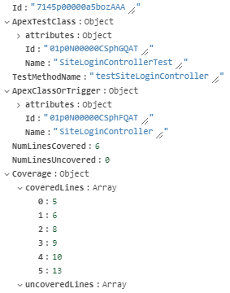

# Goal
The goal of this project is to provide a simple command-line tool with the following features:

 - Fetch all Apex code coverage data from Salesforce and accumulate them in local database (MongoDB).
 - Run analytics on the data and construct the optimal test suites for individual Apex classes and triggers. (The test suite consisting of the least possible number of test classes in order to reach the configured coverage threshold.)
 - Provide output in the form of HTML report or metadata files that can be deployed to SFDC.

Possible use cases for the results:
 - Build automation: construct the list of unit tests to run for the current package. (Not in the scope of this project.)
 - Identify test classes that do not contribute to the overall coverage. (This is part of the output report.)

# Operation


SFDC stores Apex code coverage information in the [ApexCodeCoverage](https://developer.salesforce.com/docs/atlas.en-us.api_tooling.meta/api_tooling/tooling_api_objects_apexcodecoverage.htm) object of the Tooling API.
The information stored in this object are very detailed, there are some limitations though:

 - The Tolling API does not provide sufficient querying capabilities to do meaningful aggregations.
 - The records are not retained for long. Even under the duration of a test run they are wiped out periodically.

In order to overcome this, Apex coverage records are periodically fetched from SFDC and accumulated locally in MongoDB.

# Usage
It is a prerequisite to have [MongoDB](https://www.mongodb.com/) and [Node.js](https://nodejs.org/) installed.

## Create connected app
A connected app must be created in your target SFDC instance.
| Setting | Value |
|--|--|
| Selected OAuth Scopes | Manage user data via APIs (api) |
| Callback URL | Not relevant as the username+password flow is used to connect |

:warning: Do NOT forget to grant access for your user profile.

## Create the credentials.json file
This file will contain the connection information for both SFDC and MongoDB.

```json
{
    "salesforce": {
        "target": "https://test.salesforce.com/",
        "grant": {
            "grant_type": "password",
            "client_id": "<Consumer Key from connected app>",
            "client_secret": "<Consumer Secret from connected app>",
            "username": "<your username>",
            "password": "<your password + security token if necessary>"
        }
    },
    "mongodb": "<MongoDB connection string>"
}
```

## Start test run in SFDC
Start a full local test execution on your target instance.

## Start the data collector locally
Start the data collector process:

    node src/cli.js collect --credentials=../credentials.json
 
Upon successful execution, you will receive messages similar to:

    [05:03:07] [LOG] Connected to MongoDB.
    [05:03:07] [LOG] Connected to Salesforce.
    [05:03:07] [LOG] Polling started with interval 300 seconds.
    [05:03:09] [LOG] Inserted 228 new ApexCodeCoverage record(s) of total 228.
    [05:08:11] [LOG] Inserted 0 new ApexCodeCoverage record(s) of total 228.
    [05:13:13] [LOG] Inserted 0 new ApexCodeCoverage record(s) of total 228.

When your test run is finished and you no longer receive new coverage records, stop the collector by SIGINT (Ctrl+C).

## Build reports and/or test suites
The accumulated data can be used to build coverage report and/or test suites.
The output of the following command is a set of XML files for the Metadata API:

    node src/cli.js build test-suites --credentials=../credentials.json --output-dir=./testSuites

To obtain a single HTML report file, use the following:
        
    node src/cli.js build report --credentials=../credentials.json --output-dir=./coverageReport

# Commands

Use `--help` to list the arguments for the following commands.

| Name | Description |
|--|--|
| collect | Collect Apex code coverage data from Salesforce and accumulate them in local database. |
| build | Process coverage data and build output (report or test suites). |
| clean | Remove all coverage data data accumulated in MongoDB. |